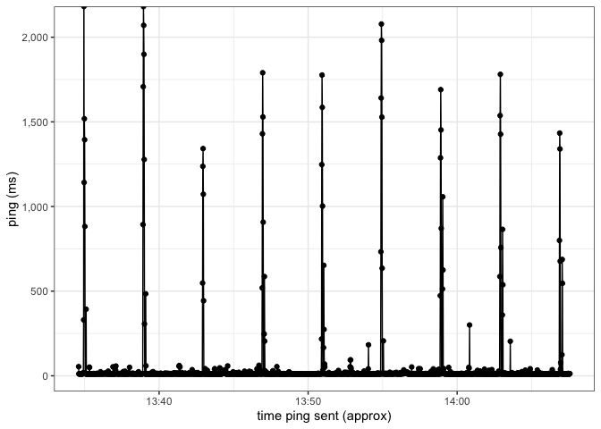

<!-- README.md is generated from README.Rmd. Please edit that file -->

# ping

<!-- badges: start -->

[](https://github.com/d-morrison/ping/actions/workflows/R-CMD-check.yaml)
<!-- badges: end -->

The goal of `ping` is to graph ping data.

## Installation

You can install the development version of ping from
[GitHub](https://github.com/) with:

``` r
# install.packages("devtools")
devtools::install_github("d-morrison/ping")
```

## Example

Here is an example, reading data from a .txt file included in the
package:

``` r
library(ping)
path_to_file = 
  fs::path_package(
  package = "ping",
  "extdata/data_2023-11-20.txt")

path_to_file |>
  process_pings_file() |>
  autoplot()
#> Extracted start time from first row of input file: 13H 34M 35S
```


